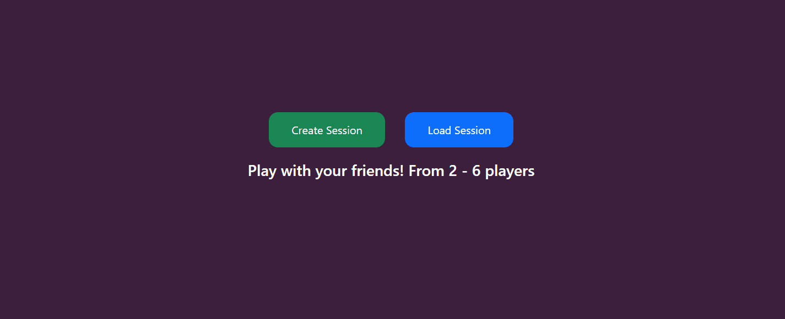
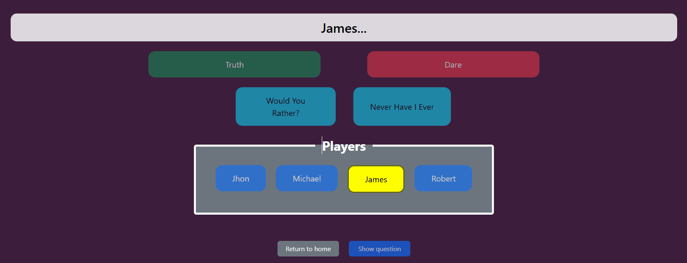

# Truth or Dare  
**A fun and simple web game developed as part of my Higher Degree in Web Development.**

---

## 📚 Table of Contents
- [📝 Description](#-description)
- [🧠 Technologies](#-technologies)
- [⚙️ Installation](#️-installation)
- [🕹️ How to Play](#-how-to-play)
- [💾 Game Architecture](#-game-architecture)
- [🔗 API](#-api)

---

## 📝 Description
The main requirement for this project was to use an existing API and base the web around it.  
After finding one related to the well-known **Truth or Dare** game, I decided it would be a great idea to develop a **fun, social game** to play with friends or family — directly from the browser!

---

## 🧠 Technologies
This project was built using:
- 🌐 **HTML5** — Structure  
- 🎨 **CSS3** — Styling and layout  
- ⚙️ **JavaScript (ES6)** — Logic and interactivity  
- 💾 **GitHub** — Version control and hosting  

---

## ⚙️ Installation
You can easily clone this repository if you’d like to make improvements or explore the code:
```bash
git clone https://github.com/Davitroon/TruthOrDare.git
```
---

## 🕹️ How to Play


### 1️⃣ Create a Session
Before starting, **create a new session**.  
Sessions allow you to **save player names, preferences, and filters** for future games.  
You can also **load previously saved sessions** to continue where you left off.  
> ⚠️ Note: Clearing your browser cache will delete all saved sessions.

---

### 2️⃣ Start the Game

Once the session is ready, the game randomly selects a **player to start** (highlighted with a yellow background).  
The selected player chooses a **question or challenge** from the available options.  
After making a choice, the question or dare is **displayed**, and the turn passes to the next player.

Questions are categorized by **age or content rating**:  
  - **PG** — Suitable for all ages .
  - **PG13** — Some questions may be awkward .
  - **R** — Adult content, for mature players only.

The **background color of the question** indicates its rating for easy identification.  

---

## 🔧 Game Architecture

### 🗂️ Data Structure
The game revolves around the **`session`** object, which stores all the information needed for a game session. Each session contains both descriptive data and operational data required for gameplay and API requests.
```JSON
{
  "creationDate": "DD/MM/YYYY",
  "name": "Session Name",
  "language": { "key": "en", "text": "English" },
  "players": ["Jhon", "Michael", "James", "Robert"],
  "filters": [
    { "key": "pg", "text": "Safe" },
    { "key": "pg13", "text": "13" }
  ],
  "extraQuestions": [
    { "key": "wyr", "text": "Would You Rather?" },
    { "key": "nhie", "text": "Never Have I Ever" }
  ]
}
```
**Descriptive data:**  
- `creationDate`, `name`, and `players` help identify and display sessions.

**Operational data:**  
- `language`, `filters`, and `extraQuestions` are used to dynamically fetch questions from the API and configure the game.  
- The **`key` field** is used to send data to the API, while the **`text` field** is used to display it in the HTML interface.

---

### 🔗 API

**Endpoint:** `https://api.truthordarebot.xyz/v1/`  
**Response:** 
```JSON
{
  "translations": {
    "bn": "আপনার DM-তে থাকা ব্যক্তিদের তালিকা দেখান।",
    "de": "Zeigen Sie die Liste der Personen in Ihren DMs an.",
    "es": "Muestra la lista de personas en tus DM.",
    "fr": "Afficher la liste des personnes dans vos DM.",
    "hi": "अपने डीएम में लोगों की सूची दिखाएं।",
    "tl": "Ipakita ang listahan ng mga tao sa iyong mga DM."
  },
  "id": "ku9abgpj8vib",
  "type": "DARE",
  "rating": "PG",
  "question": "Show the list of people in your DMs.",
  "pack": null
}
```

The game fetches questions dynamically from the **Truth or Dare API** based on the current session's settings.

1. **Requesting a question**:
   - Constructs the API URL using the selected question's `key`.
   - If filters are set (`PG`, `PG13`, `R`), a **random filter** is applied by adding `?rating={randomFilter.key}` to the URL.
   
2. **Handling the response** :
  - If the session language is not English and the translation exists, it uses the translated question. If not, it retries **fetching a new question**.
  - Displays the question in the UI prepended with the current player's name.
